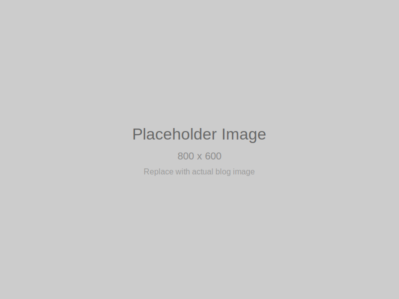

# Welcome to the Community Blog

This is a **sample blog post** that serves as a placeholder for the community blog structure.

## About This Post

This post demonstrates the basic structure and formatting available in our community blog. It includes:

- Markdown formatting support
- Front matter with metadata
- Image placeholders
- Basic content structure

## Getting Started

To create your own blog post:

1. Copy this sample post as a template
2. Update the front matter with your post details
3. Write your content using Markdown
4. Save the file in the `blog/posts/` directory

## Image Support

You can reference images from the assets folder:

```markdown

```

## Formatting Examples

### Lists

- Item one
- Item two
- Item three

### Code Blocks

```python
def hello_world():
    print("Hello, Community Blog!")
```

### Quotes

> "This is a sample quote to demonstrate blockquote formatting."

## Conclusion

This sample post provides a foundation for creating engaging community blog content. Feel free to customize it to match your needs!

---

*Last updated: 2025-12-07*
